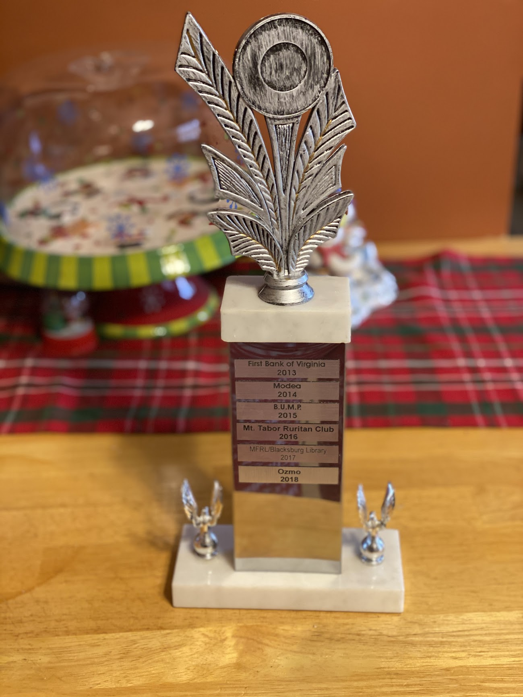
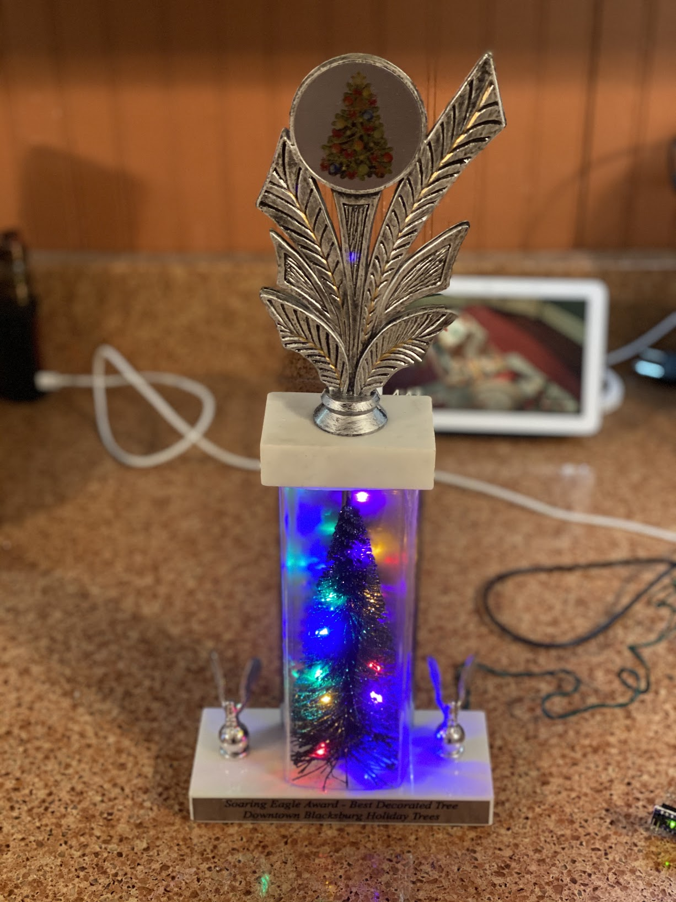
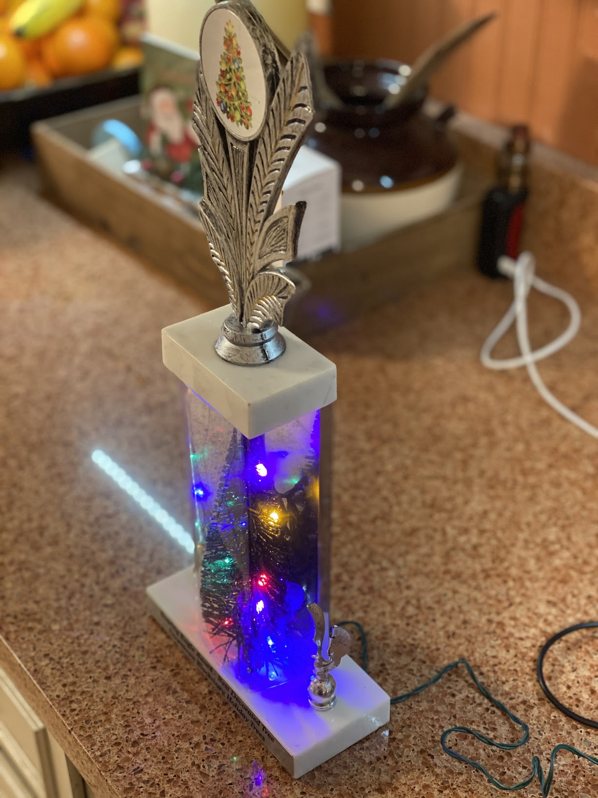

Downtown Blacksburg, Inc. Host a holiday wonderland every year in the Kent Square lobby. 

Companies from downtown are encouraged to decorate and put up a christmas tree or gingerbread house which is then judged by the local community with proceeds going to a charity.

The trophy recieved from this event is called the "Soaring Eagle Award" and until this year was pretty plain. 
Having won the trophy in 2018 for Ozmo's "DropTree" [Github](https://github.com/DavidBates/ozmotree-2018) 
They encouraged us (Ozmo) to modify the trophy before returning it. So as a personal goal I decided that since DropTree was a programmable tree the trophy needed to have a programmable tree as well. So now to introduce: 

# The 2019 Soaring Eagle Award!
### A trophy with an embedded, programmable christmas tree 🎄!

The tree includes an Arduino nano clone connected to a string of multicolored LED lights. 

